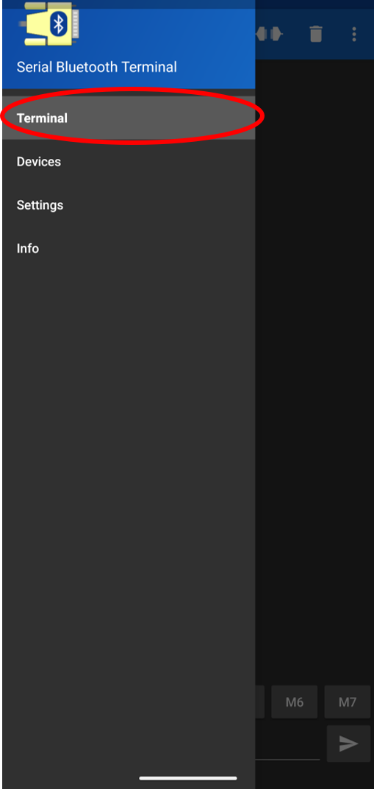

# ESP32 Bluetooth Quality Control (QC) Instructions

This directory contains the firmware and instructions required to validate the Bluetooth radio functionality of the ESP32 DevKit.

Due to differences in how Android and iOS handle Bluetooth permissions, we provide two specific testing workflows:
1. **Android:** Uses **Bluetooth Classic (SPP)** via *Serial Bluetooth Terminal*.
2. **iOS:** Uses **Bluetooth Low Energy (BLE)** via *LightBlue®*.

---

## Required Mobile Apps

Before starting, please install the appropriate application for your testing device:

| Platform | App Name | Developer | Purpose |
| :--- | :--- | :--- | :--- |
| **Android** | **Serial Bluetooth Terminal** | Kai Morich | Tests Bluetooth Classic (Serial Port Profile) |
| **iOS** | **LightBlue®** | Punch Through | Tests Bluetooth Low Energy (BLE) |

  
  &nbsp; &nbsp; &nbsp; &nbsp;
  

---

## Test 1: Android Workflow (Bluetooth Classic)

This test validates the ESP32's ability to act as a standard Bluetooth Serial device, allowing bidirectional data transfer.

### 1. Upload Firmware
* Open the `ESP32_QC_Bluetooth_Android` folder.
* Open the `.ino` file in Arduino IDE.
* **Upload** the code to the ESP32.
* Open the **Serial Monitor** (Baud: 115200) to view debug logs.

### 2. Connect via App

**Part A: Pair in Android Settings**
1.  Open **Settings > Bluetooth** on your Android phone.
2.  Scan for new devices. Look for a device named **`ESP32_QC_TEST`** (or similar).
3.  **Pair** with the device.

  

**Part B: Connect in App**
1.  Open the **Serial Bluetooth Terminal** app.
2.  Tap the hamburger menu (three lines) ☰ > **Devices**.
3.  Select **`ESP32_LED_CONTROL`**.

  
  &nbsp; &nbsp; 
  

**Part C: Run the Test**
1.  The terminal window will open displaying **Connecting to ESP32_LED_Control ...**
2.  Status should change to **"Connected"**.
3.  Type `1` in the app's text bar and hit send to turn ON the LED.
4.  Type `0` to turn OFF the LED.

  
  &nbsp; &nbsp; &nbsp; &nbsp;
  

  
  &nbsp; &nbsp; &nbsp; &nbsp;
  

---

## Test 2: iOS Workflow (BLE)

Since iOS does not support standard Bluetooth Serial (SPP) without special MFi certification, this test validates the **BLE (Bluetooth Low Energy)** hardware stack.

### 1. Upload Firmware
* Open the `ESP32_QC_Bluetooth_IOS` folder.
* Open the `.ino` file in Arduino IDE.
* **Upload** the code to the ESP32.
* Open the **Serial Monitor** (Baud: 115200).

### 2. Connect via App
* **Important:** DO NOT try to pair via the iPhone's main "Settings" menu. BLE connections must be made *inside* the app.
1.  Open the **LightBlue®** app (by Punch Through).
2.  Pull down to refresh the scan list.
3.  Look for a peripheral named **`ESP32_iPhone_Control`**.
4.  Tap **Connect**.
5.  Once connected, you will see a list of "Services" and "Characteristics".
6.  Click on the > beside the UUID and the Characteristic window will open.
7.  Ensure the value in the top right is `UTF-8 String`. You can change it selecting the current value and selecting the UTF-8 String.
8.  **Write Test:** Tap "Write new value", enter `1` and tap Write. The LED turns ON.
9.  **Write Test:** Tap "Write new value", enter `0` and tap Write. The LED turns OFF.
10. **Read Test:** Check if the value updates on the screen when the ESP32 sends a notification.

---

## Pass Criteria

The board passes the Bluetooth QC check if:
1.  The device is discoverable by the phone.
2.  The connection remains stable for at least 30 seconds (no drops).
3.  Data can be sent **from Phone to ESP32** successfully.
4.  Data can be sent **from ESP32 to Phone** successfully.

## Common Troubleshooting

* **"Connection Failed" on Android:** Ensure you unpair the device in Android Settings and re-pair it before opening the app.
* **Device not found on iOS:** Ensure you are using the *iOS/BLE* firmware. The Android firmware (Classic Bluetooth) will **not** show up on an iPhone.
* **Brownout / Reset:** If the board restarts when you try to connect, the USB port may not be supplying enough current. Try a different USB port or cable.

