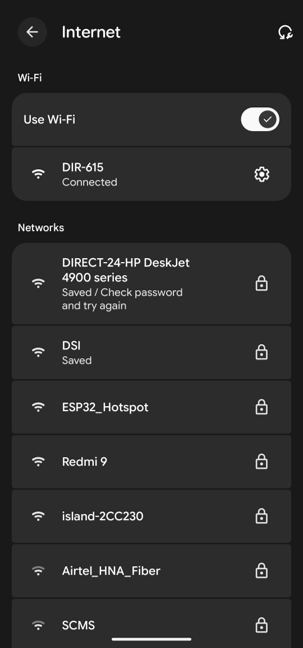
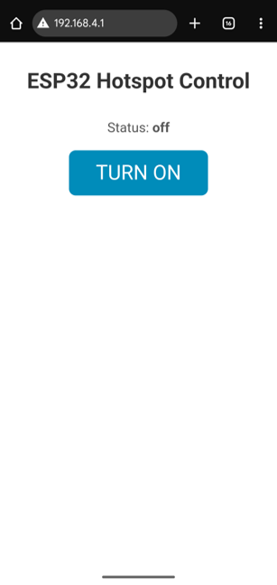
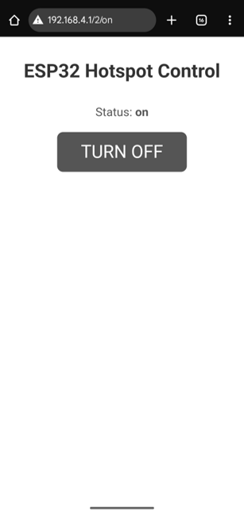
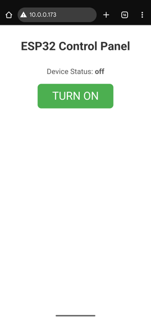
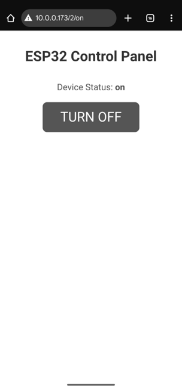

# 📶 ESP32 Wi-Fi Quality Control (QC) Instructions

This directory contains the firmware and instructions required to validate the Wi-Fi radio functionality of the ESP32 DevKit in both operating modes:

1.  **Access Point (AP) Mode:** 📡 The ESP32 creates its own Wi-Fi network.
2.  **Station (STA) Mode:** 🌐 The ESP32 connects to an existing Wi-Fi router.

<p align="center">
  
  &nbsp; &nbsp; &nbsp; &nbsp;
  
</p>

---

## 📡 Test 1: Access Point (AP) Mode
*This test verifies the ESP32's ability to broadcast a signal and host a standalone network.*

### 1. Upload Firmware 📤
* Open the folder `ESP32_QC_WIFI_AP`.
* Open `ESP32_QC_WIFI_AP.ino` in the Arduino IDE.
* **Upload** the code to the board.
* Open the **Serial Monitor** (Baud: 115200). 💻

### 2. Connect to ESP32 🔗
1.  On your phone or laptop, open Wi-Fi settings.
2.  Look for the network named: **`ESP32_Hotspot`**.
3.  Connect using the password: **`password123`**. 🔑

<p align="center">
  
  &nbsp; &nbsp; &nbsp; &nbsp;
  
</p>

### 3. Control the LED 💡
1.  Once connected, open a web browser.
2.  Type the default IP address: `192.168.4.1` (check Serial Monitor if different).
3.  You should see a web page titled **"ESP32 Hotspot Control"**.
4.  Click the **TURN ON** and **TURN OFF** buttons. 🔘

<p align="center">
  
  &nbsp; &nbsp; &nbsp; &nbsp;
  
</p>

<p align="center">
  
  &nbsp; &nbsp; &nbsp; &nbsp;
  
</p>

5.  **Pass Condition:** ✅ The blue LED on the board (GPIO 2) toggles ON/OFF instantly.

---

## 🌐 Test 2: Station (STA) Mode
*This test verifies the ESP32's ability to connect to an external router and receive an IP address via DHCP.*

### 1. Configure Credentials ⚙️
* Open the folder `ESP32_QC_WIFI_STA`.
* Open `ESP32_QC_WIFI_STA.ino` in the Arduino IDE.
* **Edit lines 6-7**: Replace the placeholders with your local Wi-Fi details. 📝
    ```cpp
    const char* ssid     = "YOUR_WIFI_NAME";
    const char* password = "YOUR_WIFI_PASSWORD";
    ```

### 2. Upload & Check Serial Monitor 📤
* **Upload** the code.
* **Immediately** open the Serial Monitor (Baud: 115200).
* The board will attempt to connect. You will see dots `...` printed while connecting. ⏳
* **Success Message:** 🎉
    ```text
    WiFi Connected!
    Control page available at: [http://192.168.1.](http://192.168.1.)X
    ```
    *(Note the IP address displayed)*.

### 3. Control the LED 💡
1.  Ensure your phone/laptop is connected to the **same Wi-Fi network** as the ESP32.
2.  Open a browser and enter the **IP address** shown in the Serial Monitor. 🌍
3.  You should see a green web page titled **"ESP32 Control Panel"**.
4.  Click **TURN ON** / **TURN OFF**. 🔘

<p align="center">
  
  &nbsp; &nbsp; &nbsp; &nbsp;
  
</p>

<p align="center">
  
  &nbsp; &nbsp; &nbsp; &nbsp;
  
</p>

5.  **Pass Condition:** ✅ The web page updates the status and the physical LED toggles.

---

## ✅ Pass Criteria

The board passes the Wi-Fi QC check if:
1.  **AP Mode:** 📡 The "ESP32_Hotspot" is visible and connectable.
2.  **STA Mode:** 🌐 The board successfully connects to the router (no infinite connecting dots).
3.  **Web Server:** 🌍 The control page loads in the browser.
4.  **GPIO Action:** ⚡ The on-board LED responds to web button clicks.

## 🛠️ Common Troubleshooting

* **Stuck on `Connecting...` (STA Mode):** ⏳
    * Double-check your SSID and Password (case sensitive).
    * Ensure your router is using 2.4GHz (ESP32 does not support 5GHz Wi-Fi).
* **"Site can't be reached" (AP Mode):** 🚫
    * Ensure your mobile data (4G/5G) is turned OFF. Some phones refuse to route local traffic if the Wi-Fi has no internet access.
* **LED not blinking:** ❓
    * Some boards use a different GPIO for the built-in LED. If GPIO 2 doesn't work, check your board's pinout.

